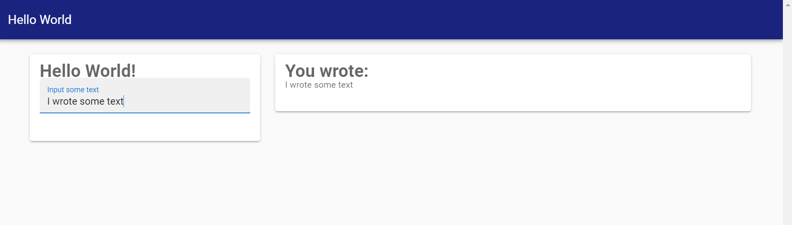

# [Getting started](@id getting-started)

## Installation

To install the latest release run the following from the `Pkg` repl (type `]` to get there):
```
pkg> add Matte
```

You can install the latest development version by running:
```
pkg> add https://github.com/angusmoore/Matte.jl.git
```

## Creating your first app

Matte comes with a number of example apps to demonstrate how it works. Let's start with the
`hello_world` example.

Open Julia and create a new Matte app, and populate it with the included `hello_world` app
by running:
```
julia> using Matte
julia> matte_example("hello_world", "path/to/example")
```

where `path/to/example` is an empty folder where you want to create the new app. Matte will
create a new project at that location. Change your working directory to that location:
```
julia> cd("path/to/example")
```
and open up the folder in your favourite editor. There are two files that Matte has created:
`app.jl` and a `Project.toml`.  `Project.toml` is a standard project file for Julia's package
manager, for specifying your app's dependencies. `app.jl` (unsurprisingly!) is the app.
It defines the server-side logic, and the UI. Open that file in your favourite editor. It
should look like this:
```
module HelloWorldApp

using Matte

const title = "Hello World"

function ui()
    sidebar_layout(
        side_panel(
            h1("Hello World!"),
            text_input("my_input", "Input some text")
        ),
        main_panel(
            h1("You wrote:"),
            p(text_output("my_output"))
        )
    )
end

module Server

function my_output(my_input)
    my_input
end

end

end
```

The next guide will dig in to what makes a Matte app and how they work. But before we do that,
let's run the app. First we need to activate the project, and load `Revise` (so that can
make changes to our app without having to restart. You don't _have_ to use `Revise`. But
you should!):
```
pkg> activate .
julia> using Revise
julia> includet("hello_world.app")
julia> run_app(HelloWorldApp)
```
Open your favourite web browser and visit `http://localhost:8000`. After a few seconds you
should see a simple webpage that looks like this:


You can type some text on the left, and it will appear on the right. Not very exciting, but
it's our first Matte app!
