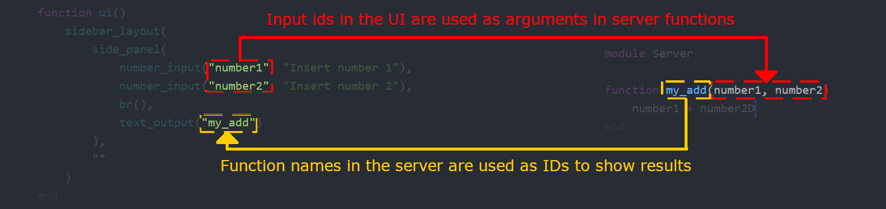

# The basics

Matte apps comprise three key elements:

* A module that defines the app
* A function that creates the UI
* A module that defines the server-side logic

Matte has a simple logic: each function in the server becomes an output in the UI. You access
the output from these functions by using the function name as the `id` for output elements
in the UI. Inputs work similarly: you assign each input in the UI an `id`; this value can be
used as an input to a function in the server module.

Let's make this concrete with an example. Suppose we want to create an app that adds two
numbers specified by our users. We define in our server module:
```
function my_add(number1, number2)
  number1 + number2
end
```

This relationship is expressed in our app accordingly:



`number1` and `number2` are the unique IDs for inputs in our UI. We access these in our function
by name. The output from that calculation, called `my_add` in our server, is accessed by name
as well, and rendered as a `text_output`.

Outputs are only recalculated when (at least) one of their inputs change.

## Defining an App module

All Matte apps are defined as modules. The modules must contain three things:

1. A `const` String called `title` that defines the app title.
2. A function called `ui` that defines (and returns!) the ui
3. A sub-module called server

You can structure this module however you like: it can be one file (like the `hello_world`
example), or split across many. There are no restrictions on the name of the app module.
The module can import packages; as with any Julia project, these just need to be added using
the package manager.

## Running an app

Starting a Matte app is done using `run_app`. This takes the module as it's only compulsory
argument.

By default, Matte runs asynchronously, so that you can still use the REPL while the server
runs in the background. If you want to stop your app without killing your REPL, just run:
```
stop_app()
```

## A quick note on Revise

Use [`Revise`](https://github.com/timholy/Revise.jl)! With Revise, you can edit your app
module (if you `includet` it) and changes will be reflected in the running app. Otherwise,
you need to redefine the module every time you make changes and re-launch your app.

Use `Revise`!

In the [next tutorial](@ref g03-ui), we'll look at the basics of building a UI in Matte.
