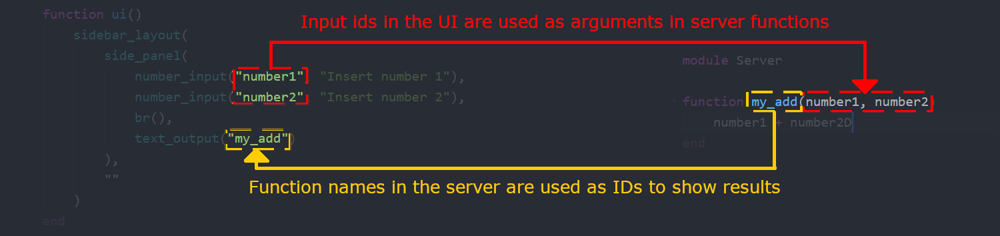

# [Server-side logic](@id g04-server)

Server-side logic defines how your app _reacts_ to user input. It's really the whole point
of Matte, otherwise you're just making pointless web pages. Server-side logic in Matte is
100% Julia, so it's easy to give your existing analysis a nice front-end.

## Structure

Server side logic is all contained in a module that must be called `Server`, which is defined
as a sub-module of your app module. This module can, of course, import other packages, modules
and code.

The structure of Matte reactivity is this:

* Each function in the server module represents an `output` variable that can be rendered in
your UI.
* These server-side functions can take as inputs any variable whose name corresponds to the
`id` of an input element in your UI



!!! note
    Matte will update the relevant element in the UI to whatever is returned by the function.
    If the function returns `nothing`, the UI will not be updated. This is helpful if you want
    to avoid re-reunning a long-running computation unless certain conditions are met. See
    [guide on long-running computations](@ref g07-long-running-computations).

## In practice

In the UI we created in the last part, we have only one `text_output` which is rendering
`my_output`. What we _want_ the app to do is take the number the user choose with the slider
(which has `id = "my_slider"`), multiply it by 10 and then show that in the UI.

To do that, all we need to do is define a function called `my_output` (which is the `id` our
`text_output` in the UI is going to render) that takes a single input called `my_slider`.

```
Module Server

function my_output(my_slider)
  my_slider * 10
end

end
```

This alignment between `id`s in the UI and function names or argument numbers is how Matte
creates relationships between UI inputs and outputs. It's a simple, but flexible model.

In the [next](@ref g05a-dataframes) [two](@ref g05b-plots) guides we'll look at incorporating
more interesting outputs into your dashboards: DataFrames and Plots.
