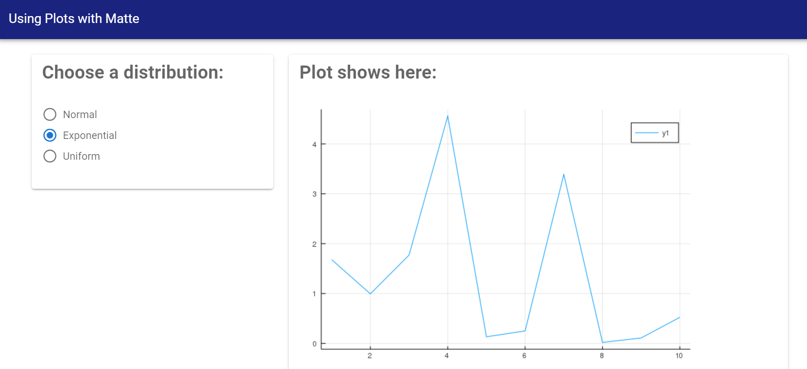

# [Including plots](@id g05b-plots)

This guide walks you through how to include a plot, created by the
[`Plots.jl`](https://github.com/JuliaPlots/Plots.jl) library, into your Matte app.

Because plots can be slow to create and show, you should also read the guide on
[long-running computations](@ref g07-long-running-computations) for tips on how to create
user interfaces that only re-calculate plots when requested by the user.

At the moment, only plots created by `Plots.jl` are supported.

## Example app

This part of the guide uses the built-in app called `plot_example`. Create a copy locally
to work on by running:
```
matte_example("plot_example", "plot_example")
```

## Incorporating a `Plots.jl` plot in your UI

Incorporating a plot into your UI is as easy as using the `plots_output` function.
This takes a single argument, which is the `id` of the output (which, of course, corresponds
to a function in the `Server` module).

You can see this element in the `main_panel` of the provided example, where we have given it
the `id` of `my_plot`:
```
function ui()
sidebar_layout(
      side_panel(
          ...
      ),
      main_panel(
          ...
          plots_output("my_plot")
      )
  )
end
```

## Plots on the backend

As with all Matte outputs elements, we need a function in the `Server` module called `my_plot`,
since this is the `id` we gave to `plots_output`. This function should return a `Plots.jl`
plot.

In the included example, we are using an input variable called `use_dist` to allow the user
to pick a distribution to sample from. This isn't particularly interesting, but provides a
little interactivity for the example.

```
function my_plot(use_dist)
    if use_dist != nothing
        if use_dist == "Normal"
            y = Random.randn(10)
        elseif use_dist == "Exponential"
            y = Random.randexp(10)
        else
            y = rand(10)
        end
        plot(1:10, y)
    end
end
```

The first part of the function checks whether the user has made a selection for `use_dist`,
if so, it draws to values from the chosen distribution and saves the values in `y`.

The key part is:
```
plot(1:10, y)
```

This creates a `Plots.jl` plot, plotting `1:10` on the x-axis and our sampled `y` values the
y-axis.

This function creates and returns a `Plots.jl` plot. Alternatively, if the user hasn't yet
selected a distribution to draw from, the function returns `nothing`, which tells Matte not
to update the UI. This is a helpful pattern for plots because it allows you to delay
re-rendering of the plot until certain conditions are met (more on that in the next two guides).

## Trying it out

Run the app (by `include`/`includet`ing the `app.jl` file and running `run_app(PlotsExample)`).
Once you select a species to filter by, you'll see something like this:



The plot may take a moment to show, particularly if you haven't used `Plots` in your session
yet, as Julia has to compile `Plots` before it can display anything.

In the [next](@ref g06a-server-side-state) [two](@ref g06b-side-effects) guides, we look at how to have persistent
server-side vairables and how to change the UI from within other functions. This is an
introduction to the helpful pattern that follows in the final guide
[handling long-running computations](@ref g07-long-running-computations)
