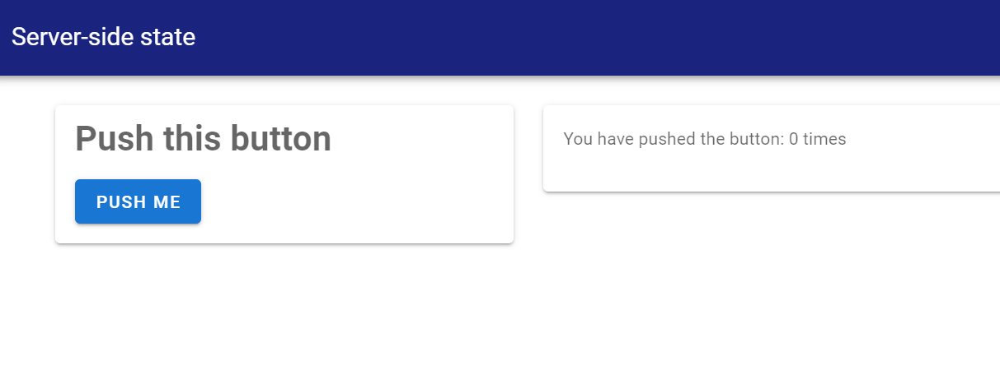

# [Server-side state](@id g06a-server-side-state)

So far, all our apps have had not concept of 'state'. Our server-side functions take the
current value of the inputs in the UI, and return some output. Our app has no memory, no way
of knowing what has happened in the past.

But what if we want to know what happened in the past?

Consider a simple problem. Suppose we want to create an app that just tracks how many times
the user has clicked a button, and then displays that result. With everything we've learned
so far, we can't. A `button` input just tells the server whether it has been clicked or not:
it returns only `true` or `false`.

Enter `session`. `session` is a way for you to be able to create variables that have
a value that is _persistent_.

## A quick example

To see this in action, let's create a copy of the `server_state` example app, which implements
exactly the problem we outlined above -- track how many times a button is pushed.

```
matte_example("server_state", "server_state")
includet("app.jl")
run_app(ServerStateExample)
```

You'll see an app that looks something like this, and the counter on the right will increment
by 1 every time your push the button. If you refresh the page (starting a new session), the
counter returns to zero.



## Step 1: Registering session variables

The first step in having persistent vars is _defining_ or 'registering' them. Matte needs to
know, in advance, the names of the variables you want to be able use. And you need to tell
Matte what initial value that variable should have when the session first starts. This is
done using the function `register_session_vars`. This function should be declared inside
your app module (at the top level, like the `ui` function). It takes no inputs, and should
return a `Dict`. This `Dict` maps symbols to values -- the symbols are the variables that
you will have access to.

In our example app, we only want one variable to track -- the number of times the user has
pushed the button. Let's call it `count` and assign it a value of `0` to begin with:
```
function register_session_vars()
    Dict(
        :count => 0
    )
end
```

## Step 2: Accessing and mutating session variables

These session variables are accessed slightly differently to regular inputs. Any server
function that you want to have access to a persistent variable _must_ take an argument
named `session` as an input. You access the session variables you registered with
`register_session_vars` using the `.` syntax to access the field of the `session`
-- i.e. `session.my_variable` etc. You can change the value of the variable simply by
assigning to this field.

In our example, we need a function that displays the current count, and that increments the
count whenever `my_button` is pushed:

```
function my_count(my_button, session)
    if my_button
        session.count += 1
    end
    session.count
end
```

The first conditional increments the count if `my_button = true` (i.e. if the button has
been pushed) by setting `session.count += 1`.

The final line simply returns the current value of the count, to be displayed in the app.

!!! note
  Be careful: `session` variables are _not_ reactive. That means that changing the value
  of a session variable in one function will not induce recomputation of any other outputs
  that depend on that session variable.

In the [next guide](@ref g06b-side-effects), we'll look at an important complement to `session` variables: being able
to change the value of _other_ UI elements within a server-side function.
