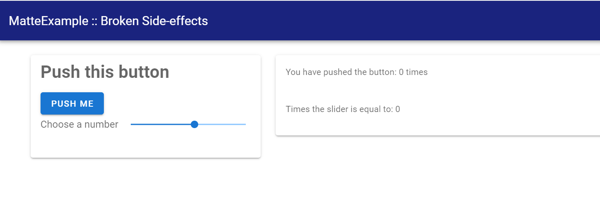

# [Side effects and manually changing the UI](@id g06b-side-effects)

Matte's computation model means that a server function can only affect one output -- the
output with the same `id` as the function name. But what if you want to change more than one?
What if your function needs to have side-effects? This is likely to happen when you have
functions that _change_ some `session` variable. As warned in the
[previous guide](@ref g06a-server-side-state), `session` variables are not reactive -- if you
have multiple outputs that depends on a `session` variable you have to _manually_ update them
when you change the value.

This is where `update_output` comes in. `update_output` can be called from inside any
server-side functions to manually an output variable to a new value.

## Setting the scene with an example

Let's make this problem concrete with a problem. Let's extend the app from the previous guide
so that, along with displaying how many times the number has been clicked, we also combine
that number with a number from a slider. The example `broken_sideeffect` mocks this problem
up. Let's run this app and see the problem:

```
matte_example("broken_sideeffect", "broken_sideeffect")
includet("app.jl")
run_app(BrokenSideEffect)
```

Open the app, which looks like this:



Push the button. You'll see the first output updates, but the second one _does not_. If you
move the slider it does, because that re-triggers the output. But the button doesn't, because
Matte doesn't recognise that `my_count` updates `session.count`.

## Fixing the problem with side effects

We can fix this by changing how `my_count` works so that we explicitly and manually update
the value of `my_calc` from within `my_count`:[^1]

```
function my_count(my_button, slider, session)
    if my_button
        session.count += 1
        update_output("my_calc", slider * session.count, session)
    end
    session.count
end
```

Don't forget to add `using Matte` to your server module, so that we can access the
`update_output` function.

If you replace `my_count` in your `app.jl` file, and refresh your app, it should now work
properly. Both numbers will update every time you click the button.

This example is obviously extremely contrived. But in the
[next guide](@ref g07-long-running-computations) we'll see a concrete useful example of when
you will want to use `update_output`: displaying progress notifications for long-running
computations.

[^1]: Of course, for an example this simple, you could _also_ solve the problem by having
`my_button` as an input to `my_calc` so that `my_calc`, is recomputed anytime the button is
pushed. This won't always work.
